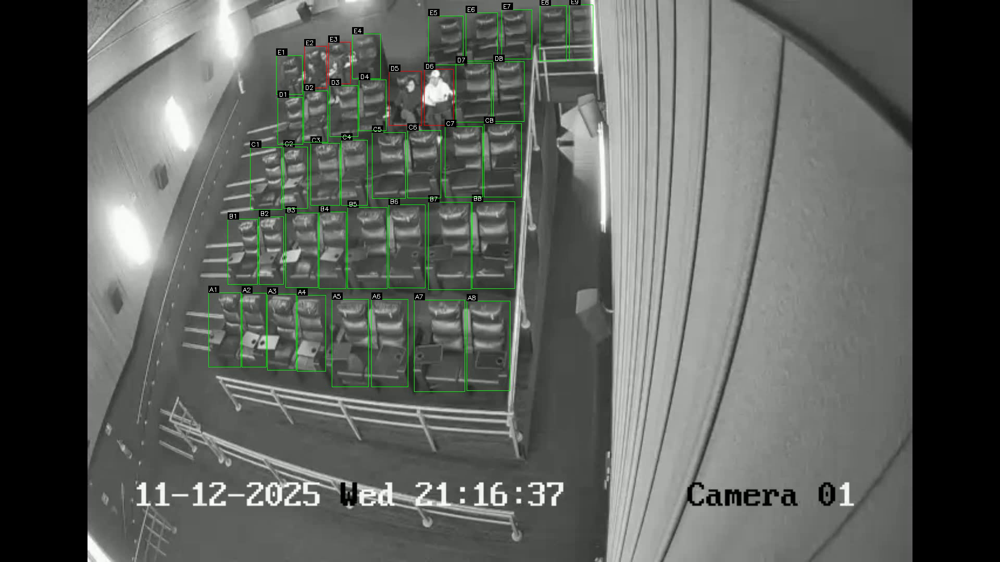

# Cinema Seat Occupancy Detection System

A computer vision system that detects and tracks seat occupancy in cinema CCTV footage using **YOLOv8** for person detection and **Supervision** for zone-based seat occupancy analysis.

[](https://docs.ultralytics.com/)
[](https://pytorch.org/)
[](https://opencv.org/)
[](https://github.com/JaidedAI/EasyOCR)
[](LICENSE)

---

# 📸 Demo



Example output showing:
- 🟥 **Red seats** → Occupied  
- 🟩 **Green seats** → Empty  
- 🪑 **Seat labels** → A1, A2, B3, etc.

---

# How It Works

### 1. Person Detection
YOLOv8 model detects people in each video frame.

### 2. Seat Zones
Pre-defined seat bounding boxes (from YOLO-format label files) are loaded as detection zones.

### 3. Occupancy Check
IoU (Intersection over Union) analysis determines if a detected person occupies a seat zone.

### 4. Temporal Smoothing
Moving window smoothing reduces false detections and flickering.

### 5. Timestamp Extraction
EasyOCR extracts CCTV timestamp overlay with smart fallback for missing frames.

### 6. Multi-format Output
Generates annotated video, JSON timeline, and CSV reports.

---

# Features

- 🎯 **Accurate Person Detection**  
  YOLOv8 model optimized for human detection.

- 🪑 **Zone-based Seat Mapping**  
  Pre-defined seat bounding boxes as detection zones.

- 📊 **IoU-based Occupancy Logic**  
  Determines seat occupation using intersection over union analysis.

- ⏱️ **Temporal Smoothing**  
  15-frame window with *"Empty after 5 consecutive empty frames"* logic.

- 🕒 **OCR Timestamp Extraction**
  - Extracts **date, time, and day** from CCTV overlay
  - Smart fallback for missing OCR detections
  - Time interpolation between frames

- 📈 **Multiple Output Formats**
  - Annotated video with colored seat overlays *(green = empty, red = occupied)*
  - JSON timeline with complete detection history
  - CSV exports at configurable intervals *(1s and 60s)*

- 🎫 **Business Logic Integration**  
  Example implementation for ticket purchase tracking.

---

# Installation

## 1. Clone the Repository

```bash
git clone <repository-url>
cd cinema-seat-detection
```

## 2. Install Dependencies

```bash
pip install -r requirements.txt
```

---

# Requirements

Create a `requirements.txt` file:

```text
ultralytics>=8.0.0
supervision>=0.18.0
opencv-python>=4.8.0
shapely>=2.0.0
tqdm>=4.66.0
easyocr>=1.7.0
pandas>=2.0.0
numpy>=1.24.0
```

---

# Input File Requirements

## 1. Video File

- CCTV footage in **MP4 format**
- Recommended resolution: **1920×1080**

---

## 2. Seat Label File (YOLO format)

Seat bounding boxes must follow the **YOLO annotation format**:

```
class x_center y_center width height
```

Example seat label file:

```
0 0.581323 0.057947 0.023623 0.097636
0 0.553012 0.059395 0.026759 0.098440
0 0.445808 0.071541 0.034594 0.087194
0 0.481932 0.065562 0.031584 0.085689
0 0.516902 0.061507 0.029797 0.088030
0 0.224566 0.587128 0.032454 0.131741
0 0.254181 0.587609 0.024611 0.130779
```

---

## 3. YOLO Model Weights

- Pre-trained **YOLOv8 model** for person detection.
- Custom-trained models can be used for improved accuracy.

---

# Configuration

Edit `config.py` to customize parameters.

```python
# config.py
from pathlib import Path

# File paths
VIDEO_PATH = "/path/to/your/video.mp4"
SEAT_LABEL_PATH = "/path/to/seat_labels.txt"
YOLO_MODEL_PATH = "/path/to/yolov8_weights.pt"
OUTPUT_DIR = Path("/path/to/output/directory")

# Model settings
CONFIDENCE_THRESHOLD = 0.1
IOU_THRESHOLD = 0.45

# Processing settings
FRAME_STRIDE = 5
SMOOTH_WINDOW = 15

OCCUPANCY_THRESHOLDS = {
    "iop": 0.15,  # Intersection over polygon
    "iob": 0.5    # Intersection over box
}

# CSV export intervals (seconds)
CSV_INTERVALS = [1, 60]

# Seat layout (optional)
ROW_COUNTS = [9, 8, 8, 8, 8]
ROW_LABELS = ["E", "D", "C", "B", "A"]

# Timestamp OCR region
TIME_REGION = (246, 915, 852, 70)  # x, y, w, h
```

---

# Usage

## Basic Usage

```python
from video_processor import process_video
from config import *

process_video(
    video_path=VIDEO_PATH,
    seat_label_path=SEAT_LABEL_PATH,
    model_path=YOLO_MODEL_PATH,
    output_dir=OUTPUT_DIR
)
```

---

## Main Pipeline Script

```python
# main.py

from video_processor import CinemaSeatDetector
from config import *

def main():
    detector = CinemaSeatDetector(
        video_path=VIDEO_PATH,
        seat_label_path=SEAT_LABEL_PATH,
        model_path=YOLO_MODEL_PATH,
        output_dir=OUTPUT_DIR
    )

    detector.run()

if __name__ == "__main__":
    main()
```

---

# Output Files

The system generates **three types of outputs**.

---

## 1. Annotated Video (`*_annotated.mp4`)

Original video with seat boundaries drawn.

- 🟩 **Green boundaries** → Empty seats
- 🟥 **Red boundaries** → Occupied seats
- Seat labels displayed above each seat

---

## 2. JSON Timeline (`*_cinema_timeline.json`)

Example:

```json
[
  {
    "timeline": "11-12-2025 Wed 21:16:30",
    "second": 0,
    "date": "11-12-2025",
    "time": "21:16:30",
    "seats": {
      "A1": "Empty",
      "A2": "Occupied",
      "A3": "Empty"
    }
  }
]
```

---

## 3. CSV Reports

### 1-second intervals (`*_timeline_1s.csv`)

| date | time | seat | status | ticket_purchase | compliance | alert | ticket_number | sms_to_worker |
|-----|-----|-----|-----|-----|-----|-----|-----|-----|
| 11/6/2025 | 21:16:30 | A1 | Empty | no | no | 0 | #A00001 | no |
| 11/6/2025 | 21:16:30 | A2 | Occupied | yes | yes | 0 | #A00002 | no |

---

### 60-second intervals (`*_timeline_60s.csv`)

Same format but sampled every **60 seconds**.

---

# Project Structure

```
cinema-seat-detection/
│
├── config.py
├── seat_utils.py
├── seat_tracker.py
├── timestamp_extractor.py
├── csv_writer.py
├── video_processor.py
├── main.py
├── requirements.txt
└── README.md
```

| File | Description |
|-----|-----|
| `config.py` | Configuration settings |
| `seat_utils.py` | Seat loading and naming utilities |
| `seat_tracker.py` | Temporal smoothing tracker |
| `timestamp_extractor.py` | OCR timestamp extraction |
| `csv_writer.py` | CSV generation utilities |
| `video_processor.py` | Main processing pipeline |
| `main.py` | Entry point |

---

# Module Documentation

## seat_utils.py

- `load_yolo_bboxes()`  
  Loads seat bounding boxes from YOLO label files.

- `group_and_name_seats()`  
  Groups seats into rows and assigns labels *(A1, A2, ...)*.

---

## seat_tracker.py

- `SmoothStatusTracker`

Maintains history for each seat and applies smoothing logic.

---

## timestamp_extractor.py

- `extract_time_from_frame()`

Functions:

- Extracts **date and time** using EasyOCR
- Uses **regex** for date `(DD-MM-YYYY)` and time `(HH:MM:SS)`
- Performs **time interpolation** for missing OCR frames

---

## video_processor.py

Main class:

```
CinemaSeatDetector
```

Responsibilities:

- Frame-by-frame video processing
- IoU-based seat occupancy detection
- Generating all output formats

---

# Customization

## Adjusting Seat Layout

Modify `config.py`.

```python
ROW_COUNTS = [9, 8, 8, 8, 8]
ROW_LABELS = ["E", "D", "C", "B", "A"]
```

---

## Tuning Occupancy Sensitivity

Adjust IoU thresholds.

```python
OCCUPANCY_THRESHOLDS = {
    "iop": 0.15,
    "iob": 0.5
}
```

Lower values = **more sensitive detection**.

---

## Modifying CSV Export Intervals

```python
CSV_INTERVALS = [1, 30, 60]
```

Exports reports every **1s, 30s, and 60s**.

---

# License

Specify your license here.

Example:

```
MIT License
```

---

# Acknowledgments

- **YOLOv8** by Ultralytics  
- **Supervision Library** by Roboflow  
- **EasyOCR** by Jaided AI
>>>>>>> 9560664 (upload codes)
